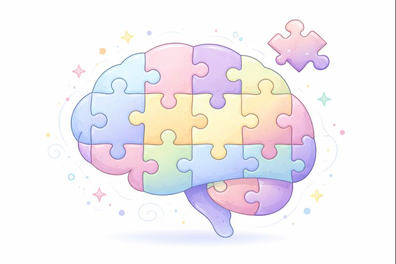

{fig-align="center" width="500"}

### **Overview of the lab's research**

Our research primarily uses neuroimaging techniques to study the brain mechanisms of psychiatric disorders, particularly schizophrenia and psychosis generally, and neuropsychiatric symptoms in neurological disorders. We study the brain as it functions in humans, and the role it plays in making us who we are. Existing datasets hold many answers, so we analyze those as much as possible before collecting new datasets.

### **Cerebellum and Aging**

Aging is marked by cognitive and affective changes with an increased risk for neuropsychiatric disorders, underscoring the need to investigate the neural mechanisms that potentially drive these outcomes. While traditionally associated with motor control, the cerebellum has been increasingly recognized for its contributions to cognition, emotion, and vulnerability to age-related disorders. Yet, how the cerebellum changes across lifespan and how these changes relate to cognitive and affective decline remains poorly understood. Our research uses structural and functional MRI to investigate cerebellar morphology, connectivity, and age-related alterations. Through this work, we aim to clarify the cerebellum’s role in healthy and pathological aging states and identify potential targets for intervention. 

### **Cerebellar Contributions to Psychotic Disorders**

Schizophrenia involves profound symptoms of psychosis, as well as affective and cognitive deficits, that emerge from disruptions in large-scale brain networks. Emerging evidence indicates that the cerebellum plays an important role in cognition and affect, but its directional influence on cortical circuitry is not well understood. Our research investigates the intrinsic activity and effective connectivity of the cerebellum using functional MRI. By mapping cerebellar alterations onto large-scale cortical and striatal networks and modeling directed interactions among these regions, we aim to clarify how cerebellar circuits reorganize in schizophrenia, and how this reorganization contributes to cortical dysfunction in schizophrenia. The goal of this work is to identify potential circuit-level targets for intervention.

### **Other Lab Projects**

The lab is currently collecting data for the **Analyses to Reveal Trajectories and Early Markers of Imminent Shifts in Suicidal States (ARTEMIS**) Study as well as being involved in the **Enhancing Neuroimaging Genetics through Meta/Mega Analysis (ENIGMA)** Schizophrenia ([ENIGMA Working Groups](https://enigma.ini.usc.edu/ongoing/))
